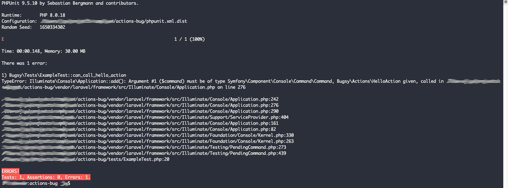

# Action as Command Bug?

There's a very simple Action that's supposed to work as a command here:

[HelloAction](src/Actions/HelloAction.php)

I've registered that command using a very simple service provider here:

[PackageServiceProvider](src/PackageServiceProvider.php)

It works fine if you call it from artisan:

	php artisan hello:world

But if I try to write a test for it following examples from here:

[https://laravel.com/docs/9.x/console-tests](https://laravel.com/docs/9.x/console-tests)

Laravel throws an error:

	TypeError: Illuminate\Console\Application::add(): Argument #1 ($command) must be of type
	Symfony\Component\Console\Command\Command, Bugsy\Actions\HelloAction given, called in 
	/actions-bug/vendor/laravel/framework/src/Illuminate/Console/Application.php on line 276

I've created a simple test to show that error here:

[ActionTest](tests/ActionTest.php)

This appears to be related to a lorisleiva/laravel-actions past issue here:

[https://github.com/lorisleiva/laravel-actions/issues/108](https://github.com/lorisleiva/laravel-actions/issues/108)

To replicate, simply clone this repo, run composer install, and run phpunit

	1. git clone https://github.com/firebender/actions-bug
	2. cd actions-bug
	3. composer install
	4. vendor/bin/phpunit

The following screenshot is my experience when I try to run my test:

